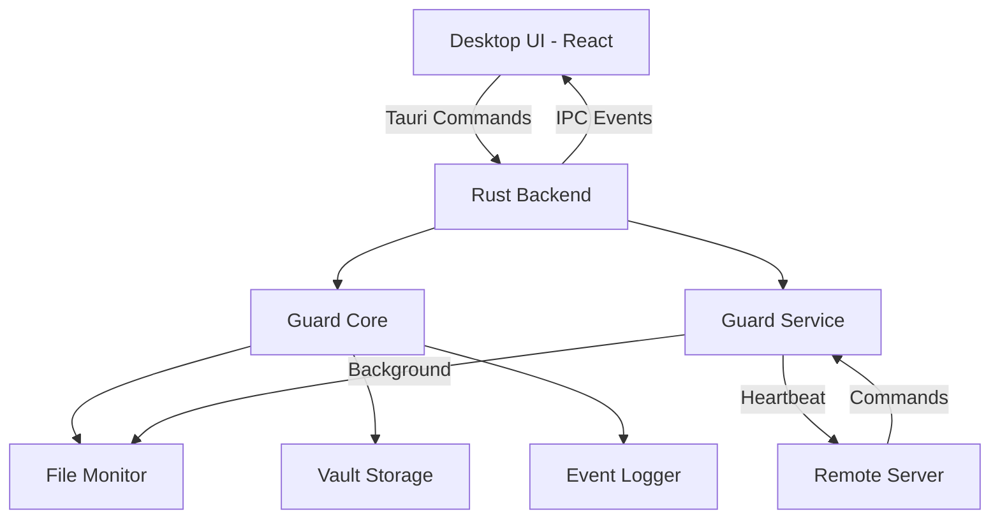

<div align="center">

# 🛡️ Darklock Guard

**Advanced Security & Device Protection System - Technical Showcase**

[](LICENSE)
[](https://tauri.app)
[](https://reactjs.org)
[](https://www.rust-lang.org)
[](https://www.typescriptlang.org)

*A comprehensive demonstration of modern security architecture, cross-platform desktop development, and cryptographic file integrity monitoring.*

[Overview](#-overview) • [Architecture](#-architecture) • [Technical Features](#-technical-features) • [Implementation](#-implementation-details)

</div>

---

## 📖 Overview

**Darklock Guard** is a private project being open-sourced as a technical showcase. This repository demonstrates enterprise-grade security architecture in a cross-platform desktop application, highlighting advanced implementation of file integrity monitoring, cryptographic security, and modern UI/UX patterns.

> **⚠️ Important:** This is a **private project made open source for portfolio/demonstration purposes only**. It is not intended for public installation or use. The code is provided to showcase security architecture, full-stack development capabilities, and technical implementation patterns.

### 🎯 What This Project Demonstrates

- 🏗️ **Full-Stack Architecture** - Complete Rust backend with React/TypeScript frontend integration
- 🔐 **Cryptographic Security** - HMAC-based file integrity verification and encrypted vault systems
- 🎨 **Modern UI/UX** - Polished desktop interface with Radix UI primitives and Tailwind CSS
- ⚡ **Performance** - Rust async runtime (Tokio) for efficient system monitoring
- 🔄 **IPC Communication** - Seamless frontend-backend communication via Tauri's command system
- 🏛️ **Security Architecture** - Multi-mode operation with zero-trust security principles
- 🌐 **Cross-Platform** - Single codebase targeting Windows, macOS, and Linux

---

## 🔍 Technical Features

### 🔐 Security Architecture

**Multi-Mode Security System**
```rust
enum ServiceMode {
    Normal,       // Standard protection mode
    ZeroTrust,    // All actions require verification
    SafeMode,     // Recovery mode with limited functionality
    Disconnected  // Offline operation
}
```
- State machine managing security transitions
- Safe mode triggers on integrity failures, vault corruption, or service crashes
- Each mode enforces different capability restrictions

**File Integrity Monitoring**
- HMAC-SHA256 signature verification for critical files
- Baseline manifest system tracking expected file states
- Real-time inotify/FSEvents monitoring for file changes
- Cryptographic verification pipeline:
  ```
  File → Hash → HMAC(hash, secret) → Compare with baseline → Action
  ```

**Encrypted Vault System**
- AES-256-GCM encryption for sensitive storage
- Key derivation using Argon2id
- Automatic corruption detection and recovery
- Secure memory wiping on key disposal

### 📊 System Architecture

**Event Logging Pipeline**
```typescript
interface EventEntry {
  timestamp: string;
  severity: 'info' | 'warning' | 'error';
  message: string;
  data?: Record<string, unknown>;
}
```
- Structured event system with severity levels
- Persistent storage in SQLite for audit trails
- Real-time event streaming to UI via Tauri IPC
- Filterable and exportable event history

**Security Scanning Engine**
- Async Rust scanner using Tokio for parallel file operations
- Configurable scan depth and file type filtering  
- Threat detection based on signature database
- Progress reporting with cancellation support

**Update System**
- Cryptographically signed update packages
- Backup manifest creation before updates
- Atomic update application with automatic rollback
- Multi-channel support (stable/beta) with version tracking

**Remote Device Management**
- WebSocket connection to cloud management server
- Command queue with status tracking (PENDING → COMPLETED/FAILED)
- Remote security profile switching
- Heartbeat system for connection monitoring

---

## 🏗️ Implementation Details

### Technology Decisions

**Why Tauri over Electron?**
- **Smaller bundle size:** ~3MB vs ~100MB+ (Electron includes full Chromium)
- **Memory efficiency:** Single WebView instance vs entire browser runtime
- **Native performance:** Rust backend with zero-cost abstractions
- **Security:** No Node.js runtime in renderer, strict IPC command system

**Frontend Stack Rationale**
```javascript
// Modern React patterns with TypeScript
- Vite for instant HMR and optimized builds
- Radix UI for accessible, unstyled primitives
- Tailwind CSS for rapid UI development with type-safe classes
- Context + Hooks for lightweight state management
```

**Backend Architecture**
```rust
// Workspace structure for code organization
├── guard-core       // Shared security primitives
├── guard-service    // Background monitoring service
└── updater-helper   // Secure update management
```

### Key Implementation Patterns

**Tauri IPC Commands**
```rust
#[tauri::command]
async fn get_status() -> Result<ServiceStatus, String> {
    // Backend command exposed to frontend
    let status = service_state::get_current_status().await;
    Ok(status)
}
```

**Type-Safe Frontend/Backend Communication**
```typescript
// Shared TypeScript interfaces match Rust structs
export type ServiceStatus = {
  ok: boolean;
  mode: ServiceMode;
  connected: boolean;
  capabilities: CapabilityMap;
};
```

**Async Rust with Tokio**
```rust
// Efficient concurrent operations
let (tx, rx) = mpsc::channel(100);
tokio::spawn(async move {
    file_monitor::watch_files(tx).await
});
```

---

## 💡 How It Works

### Application Flow



### Security Mode State Machine

```
┌─────────────┐
│   Normal    │ ◄──── Default state, full functionality
└──────┬──────┘
       │
       ├─── integrity_failure ───► ┌─────────────┐
       │                           │  Safe Mode  │ ◄─── Recovery mode
       ├─── vault_corrupt ────────►└─────────────┘
       │
       └─── user_request ─────────► ┌─────────────┐
                                     │ Zero Trust  │ ◄─── Max security
                                     └─────────────┘
```

### File Integrity Verification Process

1. **Baseline Creation:** Calculate HMAC signatures for protected files
2. **Monitoring:** Watch for file system events (modify, delete, move)
3. **Verification:** On change detected, recalculate HMAC and compare
4. **Response:** Log event, notify UI, optionally quarantine or restore

### UI Component Architecture

**Pages as Feature Modules**
```typescript
StatusPage.tsx       → Real-time dashboard with service status
ProtectionPage.tsx   → File integrity configuration & monitoring
ScansPage.tsx        → Security scan management and history
EventsPage.tsx       → Event log viewer with filtering
UpdatesPage.tsx      → Update management and version control
DeviceControlPage.tsx → Remote device connection management
SettingsPage.tsx     → Application preferences and configuration
```

**State Management Pattern**
```typescript
// Centralized service state via Context
const { status, serviceAvailable } = useService();

// Tauri command invocation
const result = await invoke('get_status');
```

---

## �️ Architecture Deep Dive

### System Architecture

```
┌─────────────────────────────────────────────────────────┐
│                    Desktop UI (Tauri)                   │
│  ┌──────────────────────────────────────────────────┐  │
│  │         React + TypeScript Frontend              │  │
│  │  • Pages (Status, Protection, Scans, Events)    │  │
│  │  • Components (Radix UI primitives)             │  │
│  │  • State Management (Context + Hooks)           │  │
│  └────────────────┬─────────────────────────────────┘  │
│                   │ Tauri IPC Commands                  │
│  ┌────────────────▼─────────────────────────────────┐  │
│  │              Rust Backend (Tauri)               │  │
│  │  • Command handlers                             │  │
│  │  • Event emitters                               │  │
│  │  • Platform integration                         │  │
│  └────────────────┬─────────────────────────────────┘  │
└───────────────────┼─────────────────────────────────────┘
                    │
         ┌──────────┴──────────┐
         │                     │
    ┌────▼─────┐         ┌────▼──────┐
    │  Guard   │         │  Guard    │
    │   Core   │◄────────┤  Service  │
    └────┬─────┘         └────┬──────┘
         │                    │
    ┌────▼─────────────────────▼────┐
    │  • File Monitor (inotify)     │
    │  • Vault (AES-256-GCM)        │
    │  • Event Logger (SQLite)      │
    │  • HMAC Verification          │
    │  • Update Manager             │
    └───────────────────────────────┘
```

### Module Responsibilities

**guard-core** - Shared security primitives  
```rust
- crypto.rs          → Encryption, HMAC, key derivation
- vault.rs           → Secure storage with error recovery
- event_log.rs       → Structured event system
- settings.rs        → Configuration management
- safe_mode.rs       → Safety state machine
```

**guard-service** - Background monitoring daemon  
```rust
- file_monitor.rs    → FS event watching & verification
- service_state.rs   → Service orchestration
- remote_api.rs      → Cloud connection management
- scanner.rs         → Security scanning engine
```

**desktop/src-tauri** - UI backend  
```rust
- main.rs            → Tauri app initialization
- commands/          → IPC command handlers
- state.rs           → Shared application state
```

**desktop/src** - React frontend  
```typescript
- pages/             → Feature-based page components
- components/        → Reusable UI components
- state/            → Global state & service integration
- api.ts            → Type-safe Tauri command wrappers
- types.ts          → Shared TypeScript interfaces
```

---

## 🛠️ Development Reference

> **Note:** These commands are provided for reference to understand the development workflow. This is not a guide for public installation.

### Build Commands (Reference)

```bash
# Development mode with hot reload (if running locally)
cd desktop && npm run tauri

# Production build command
npm run tauri:build
# Output: desktop/src-tauri/target/release/bundle/
```

### Configuration Architecture

**Environment Variables** (`.env`)
```env
VITE_API_URL=http://localhost:3001      # Backend API
VITE_PLATFORM_URL=http://localhost:3002 # Cloud platform  
VITE_DEV_MODE=true                      # Dev features
```

**Platform-Specific Storage**
```
Windows:  %APPDATA%\com.darklock.guard\settings.json
macOS:    ~/Library/Application Support/com.darklock.guard/
Linux:    ~/.config/darklock-guard/settings.json
```

**Settings Schema**
```typescript
interface GuardSettings {
  protectedPaths: string[];          // Files to monitor
  scanSchedule: string;              // Cron expression
  autoUpdate: boolean;               // Update behavior
  updateChannel: 'stable' | 'beta';  // Release channel
  remoteEnabled: boolean;            // Cloud features
}
```

---

## � Technical Highlights

### Performance Optimizations

**Async Rust for Concurrency**
```rust
// Process multiple files in parallel
let handles: Vec<_> = files
    .iter()
    .map(|f| tokio::spawn(verify_file(f.clone())))
    .collect();
```

**React Optimization Patterns**
```typescript
// Prevent unnecessary re-renders
const MemoizedComponent = React.memo(EventRow);

// Debounced search for large event logs
const debouncedSearch = useMemo(
  () => debounce(handleSearch, 300),
  []
);
```

**Efficient IPC Communication**
```typescript
// Stream events instead of polling
invoke('subscribe_to_events').then(() => {
  listen('security-event', (event) => {
    // Real-time updates without HTTP overhead
  });
});
```

### Security Considerations

✅ **Implemented Protections**
- HMAC-SHA256 prevents tampering with integrity signatures
- Argon2id key derivation resists brute-force attacks  
- Secure memory wiping prevents key extraction
- IPC command whitelist prevents arbitrary code execution
- WebView CSP header prevents XSS in UI

### Code Quality Tools

```bash
cargo clippy --all-targets  # Rust linting
cargo fmt --all             # Code formatting
cargo test --workspace      # Unit tests
npm run lint               # ESLint + TypeScript checks
```

---

## 📚 Learning Resources

This project demonstrates concepts from:

**Security**
- [Cryptographic Hash Functions](https://en.wikipedia.org/wiki/Cryptographic_hash_function) - HMAC implementation
- [Authenticated Encryption](https://en.wikipedia.org/wiki/Authenticated_encryption) - AES-GCM vault
- [Zero Trust Architecture](https://www.nist.gov/publications/zero-trust-architecture) - Security model

**Rust Development**  
- [The Rust Book](https://doc.rust-lang.org/book/) - Language fundamentals
- [Tokio Tutorial](https://tokio.rs/tokio/tutorial) - Async runtime patterns
- [Tauri Guides](https://tauri.app/v1/guides/) - Desktop app framework

**Frontend Architecture**
- [React Patterns](https://reactpatterns.com/) - Component design
- [Radix UI](https://www.radix-ui.com/primitives) - Accessible components
- [TypeScript Handbook](https://www.typescriptlang.org/docs/handbook/intro.html) - Type system

---

## 📄 License

This project is licensed under the **MIT License** - see the [LICENSE](LICENSE) file for details.

---

## 🙏 Acknowledgments

- Built with [Tauri](https://tauri.app)
- UI powered by [Radix UI](https://www.radix-ui.com) and [Tailwind CSS](https://tailwindcss.com)
- Icons by [Lucide](https://lucide.dev)

---

## � Project Stats

- **Languages:** Rust, TypeScript, CSS
- **Lines of Code:** ~28,000+
- **Frontend:** 177 files across React components, pages, and utilities
- **Backend:** 3 Rust crates with shared workspace
- **UI Components:** Built with Radix UI primitives + Tailwind CSS
- **Security Features:** HMAC verification, AES-256-GCM encryption, event logging

---

## 🔗 Related Projects

This project demonstrates integration with:
- Discord security bot (main platform integration)
- Cloud management dashboard (remote device control)
- Anti-tampering service (physical hardware monitoring)

---

## 📄 License

MIT License - See [LICENSE](LICENSE) for details.

**⚠️ Disclaimer:** This is a **private project open-sourced for demonstration purposes only**. The code is provided as-is to showcase technical capabilities and implementation patterns. It is not intended for public deployment, modification, or use in production environments.

---

## 🛠️ Built With

<div align="center">

| Category | Technologies |
|----------|-------------|
| **Frontend** | React 18, TypeScript, Vite, Tailwind CSS |
| **UI Components** | Radix UI, Lucide Icons |
| **Backend** | Rust, Tauri 2.0, Tokio |
| **Security** | HMAC-SHA256, AES-256-GCM, Argon2id |
| **Storage** | SQLite (event logs), JSON (settings) |
| **Build Tools** | Cargo, npm, Vite |

</div>

---

<div align="center">

### 🎓 Portfolio Project

*Demonstrating enterprise-grade security architecture, cross-platform development,*  
*and modern full-stack engineering practices.*

**Tech Stack:** Rust • TypeScript • React • Tauri • Cryptography

[⬆ Back to Top](#️-darklock-guard)

</div>
